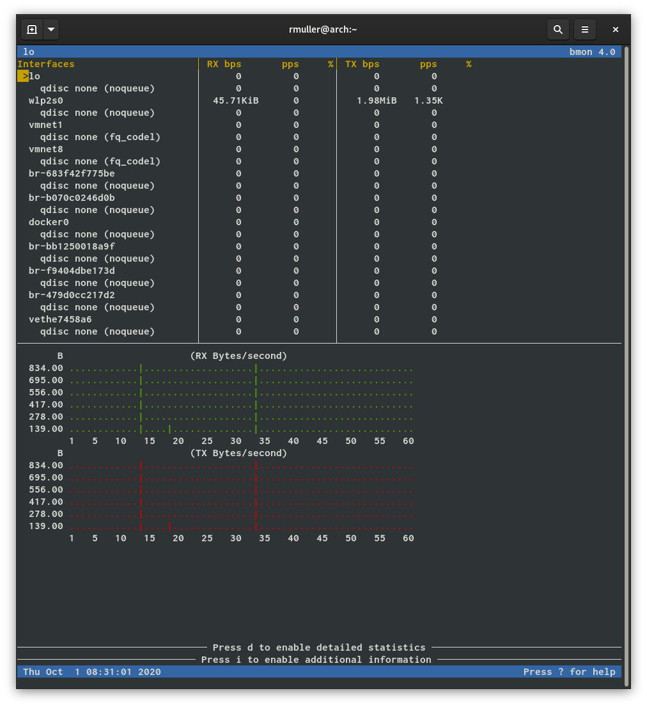

## AIT Lab 02 - File system snapshots

**Author:** Müller Robin, Stéphane Teixeira Carvalho, Massaoudi Walid  
**Date:** 2020-09-30

### Task 1: Local sync

In this task you will create incremental backups of a home directory
by using file synchronization and file system snapshots. To store the
backup you will use the backup disk you partitioned in the previous
lab.

1.  Choose a home directory, preferably your own, for which to create
    a backup. A full uncompressed backup should fill the ext4
    partition of the backup disk to not more than 50%. If the home
    directory is too big, choose an appropriate sub-tree. To find out
    how much space is occupied by a directory tree you can use the
    command `du -sh <directory>`. The directory will be called the
    source directory.

    ```bash
    stephane@ubuntu:~$ du -sh ~
    7.3M	/home/stephane
    ```

    For this task we can use the home directory as the source directory.

2.  On the backup disk, on the ext4 partition, create a directory
    called `<username>_backup` that will contain the backup. Change
    the owner of this directory from root to the owner of the source
    directory so that (1) you do not need superuser rights to copy
    files into it and (2) the user can directly read files back from
    the directory without needing superuser rights. The directory will
    be called the backup directory.

    ```bash
    stephane@ubuntu:~$ sudo mkdir /mnt/backup2/stephane_backup
    stephane@ubuntu:~$ ls -l /mnt/backup2/
    total 4
    drwxr-xr-x 2 root root 4096 oct  5 13:24 stephane_backup
    stephane@ubuntu:~$ sudo chown stephane /mnt/backup2/stephane_backup
    stephane@ubuntu:~$ ls -l /mnt/backup2/
    total 4
    drwxr-xr-x 2 stephane root 4096 sep 30 05:55 stephane_backup
    ```

    We used the mouting points created in the previous lab to create the directory on the ext4 partiton.

3.  Perform an initial copy of the source directory to the backup
    directory.

    In the backup directory you will create a series of
    sub-directories for the backups. Their name consists of a timestamp of the time the backup was made:

        * aeinstein_backup
            * 2017-09-25-093533
            * 2017-09-25-101142
            * 2017-09-25-104812

    * What do these options do?
      - `-a` : archive files and directory while synchronizing ( -a equal to following options -rlptgoD)
      - `-v` : will be able to make a verbose output  
    * Specifically, which options are implied by the `-a` option and what do they do?
      - As shown above the option `-a` is a shortcut for the following options :
        - `-r` : sync files and directories recursively
        - `-l` : copy symlinks as symlinks during the sync
        - `-p` : preserve permissions
        - `-t` : preserve modification times
        - `-g` : preserve group
        - `-o` : preserve owner
        - `-D` : preserve device files and preserve special files
    * How can you use the `date` command to avoid typing the timestamp of the current time? How do you make `date` produce UTC time?
     - For that we can use the following command :
        - `date -u "+%Y-%m-%d-%H%M%S"`
          - the parameter `%Y` will show the year in the format 20XX
          - the parameter `%m` will show the month in digits
          - the parameter `$d` will show the days in digits
          - the parameter `%H` will show the hours
          - the parameter `%M` will show the minutes
          - the parameter `%S` will show the seconds
          - the option `-u` will show the time in UTC

          Here is the result of the command :
    ```bash
    stephane@ubuntu:~$ date -u "+%Y-%m-%d-%H%M%S"
    2020-09-30-131944
    ```
    We can see that the result of the date command is the one expected for the lab.

    After knowing all the commands to do the rsync we ran the following command :
    ```bash
    stephane@ubuntu:~$ rsync -av ~ /mnt/backup2/stephane_backup/$(date -u "+%Y-%m-%d-%H%M%S")
    sending incremental file list
    created directory /mnt/backup2/stephane_backup/2020-09-30-133536
    stephane/
    stephane/.ICEauthority
    stephane/.bash_history
    stephane/.bash_logout
    stephane/.bashrc
    stephane/.pam_environment
    stephane/.profile
    stephane/.sudo_as_admin_successful
    stephane/.xinputrc
    stephane/backup.tar.gz
    stephane/backupincr.tar.gz
    ...
    ```

    * How much disk space is used by the backup directory?

      ```bash
      stephane@ubuntu:~$ ls -l /mnt/backup2/stephane_backup
      total 4
      drwxr-xr-x 3 stephane stephane 4096 sep 30 15:35 2020-09-30-133536
      stephane@ubuntu:~$ du -sh /mnt/backup2/stephane_backup/
      7.3M	/mnt/backup2/stephane_backup/
      ```

      We can see that the backup directory as the same size as the source directory.

4.  Without having modified a file in the source directory do an
    incremental backup using hard links. As before the name of the
    destination directory is the current timestamp.

    In addition to the `rsync` options of the previous step, use the
    following options (use `man` to find out what they do):

    * `--delete` : delete extraneous files from destination dirs
    * `--link-dest` to do an incremental backup using hard links

    Heres is the result of the rsync command :
    ```bash
    stephane@ubuntu:~$ rsync -av --delete --link-dest=/mnt/backup2/stephane_backup/2020-09-30-133536 ~ /mnt/backup2/stephane_backup/$(date -u "+%Y-%m-%d-%H%M%S")
    sending incremental file list
    created directory /mnt/backup2/stephane_backup/2020-09-30-135543
    stephane/.config/nautilus/
    stephane/.config/nautilus/desktop-metadata
    stephane/.local/share/gvfs-metadata/
    stephane/.local/share/gvfs-metadata/root
    stephane/.local/share/gvfs-metadata/root-407fb817.log
    stephane/.local/share/zeitgeist/activity.sqlite-shm
    stephane/.local/share/zeitgeist/activity.sqlite-wal

    sent 336,245 bytes  received 370 bytes  673,230.00 bytes/sec
    total size is 6,293,293  speedup is 18.70
    ```

    How much disk space is used by the backup directory according to
    the `du` command? How much by the individual snapshot directories? How do
    you explain what `du` displays (if you had to write the `du` command, how would you count hard links)?

    ```bash
    stephane@ubuntu:~$ du -sh /mnt/backup2/stephane_backup/
    8.1M	/mnt/backup2/stephane_backup/
    stephane@ubuntu:~$ du -sh /mnt/backup2/stephane_backup/*
    7.3M	/mnt/backup2/stephane_backup/2020-09-30-133536
    744K	/mnt/backup2/stephane_backup/2020-09-30-135543
    ```

    With the `du` command we can see that all the files that were unchanged are hard linked to the first backup and so the second backup is way smaller than the first backup. This is due to the fact that we used `--linked-dest`

5.  Modify a file in the source directory and perform another
    incremental backup like in the previous step.

    For this manipulation we decide to change a file named `snapshot.file` in the home directory.

    When doing the rsync we can see that the file is added  :

    ```bash
    stephane@ubuntu:~$ rsync -av --delete --link-dest=/mnt/backup2/stephane_backup/2020-09-30-133536 ~ /mnt/backup2/stephane_backup/$(date -u "+%Y-%m-%d-%H%M%S")
    sending incremental file list
    created directory /mnt/backup2/stephane_backup/2020-09-30-140922
    stephane/
    stephane/snapshot.file
    stephane/.config/nautilus/
    stephane/.config/nautilus/desktop-metadata
    stephane/.local/share/
    stephane/.local/share/gvfs-metadata/
    stephane/.local/share/gvfs-metadata/root
    stephane/.local/share/gvfs-metadata/root-407fb817.log
    stephane/.local/share/nano/
    stephane/.local/share/zeitgeist/activity.sqlite-shm
    stephane/.local/share/zeitgeist/activity.sqlite-wal

    sent 336,366 bytes  received 404 bytes  673,540.00 bytes/sec
    total size is 6,293,297  speedup is 18.69
    ```

    Using the `stat` command examine the inodes of different versions
    of a file. Do this for a file that **has not** changed between
    backups and for a file that **has** changed. What do you see?

    Here is the result for a file that as changed :
    ```bash
    stephane@ubuntu:/mnt/backup2/stephane_backup$ stat 2020-09-30-140922/stephane/snapshot.file
      File: 2020-09-30-140922/stephane/snapshot.file
      Size: 40        	Blocks: 8          IO Block: 4096   regular file
    Device: 801h/2049d	Inode: 1208538     Links: 1
    Access: (0644/-rw-r--r--)  Uid: ( 1000/stephane)   Gid: ( 1000/stephane)
    Access: 2020-09-30 16:09:22.797117150 +0200
    Modify: 2020-09-30 16:07:33.112541821 +0200
    Change: 2020-09-30 16:09:22.797117150 +0200
     Birth: -
    stephane@ubuntu:/mnt/backup1/stephane_backup$ stat 2020-09-30-133536/stephane/snapshot.file
      File: 2020-09-30-133536/stephane/snapshot.file
      Size: 36        	Blocks: 8          IO Block: 4096   regular file
    Device: 801h/2049d	Inode: 1199058     Links: 2
    Access: (0644/-rw-r--r--)  Uid: ( 1000/stephane)   Gid: ( 1000/stephane)
    Access: 2020-09-30 15:35:36.387552314 +0200
    Modify: 2020-09-29 18:24:40.401061651 +0200
    Change: 2020-09-30 15:55:43.228826935 +0200
     Birth: -
    ```
    In this case we can see that the inode as changed and the hours of access too. We can also see that the file that has not be chnaged has 2 links. It means that the 2 backups are pointing to the same inode.

    In contrast, when a file is unchanged we can see that they use the same inode and this time the number of liks equls 3 because we didi 3 backups :
    ```bash
    stephane@ubuntu:/mnt/backup2/stephane_backup$ stat 2020-09-30-140922/stephane/myScan.xml
      File: 2020-09-30-140922/stephane/myScan.xml
      Size: 15845     	Blocks: 32         IO Block: 4096   regular file
    Device: 801h/2049d	Inode: 1198468     Links: 3
    Access: (0644/-rw-r--r--)  Uid: ( 1000/stephane)   Gid: ( 1000/stephane)
    Access: 2020-09-30 15:35:36.387552314 +0200
    Modify: 2020-09-25 13:07:25.000052231 +0200
    Change: 2020-09-30 16:09:22.789117109 +0200
     Birth: -
    stephane@ubuntu:/mnt/backup2/stephane_backup$ stat 2020-09-30-133536/stephane/myScan.xml
      File: 2020-09-30-133536/stephane/myScan.xml
      Size: 15845     	Blocks: 32         IO Block: 4096   regular file
    Device: 801h/2049d	Inode: 1198468     Links: 3
    Access: (0644/-rw-r--r--)  Uid: ( 1000/stephane)   Gid: ( 1000/stephane)
    Access: 2020-09-30 15:35:36.387552314 +0200
    Modify: 2020-09-25 13:07:25.000052231 +0200
    Change: 2020-09-30 16:09:22.789117109 +0200
     Birth: -

    ```

    How much disk space is used by the backup directory?
    ```bash
    stephane@ubuntu:/mnt/backup2/stephane_backup$ du -sh /mnt/backup2/stephane_backup/
    8.8M	/mnt/backup2/stephane_backup/
    ```

    As expected the directory only grew for about 700K due to the fact of the new backup.

6.  Delete the initial full backup. What happens to the files in the
    incremental backup that were hardlinked to the files of the full
    backup?

    ```bash
    stephane@ubuntu:/mnt/backup2/stephane_backup$ rm -rf 2020-09-30-133536
    stephane@ubuntu:/mnt/backup2/stephane_backup$ stat 2020-09-30-140922/stephane/myScan.xml
      File: 2020-09-30-140922/stephane/myScan.xml
      Size: 15845     	Blocks: 32         IO Block: 4096   regular file
    Device: 801h/2049d	Inode: 1198468     Links: 2
    Access: (0644/-rw-r--r--)  Uid: ( 1000/stephane)   Gid: ( 1000/stephane)
    Access: 2020-09-30 15:35:36.387552314 +0200
    Modify: 2020-09-25 13:07:25.000052231 +0200
    Change: 2020-09-30 16:26:34.774531979 +0200
     Birth: -
    ```

    We can see that the inode has not changed even after the deletion of the original backup. This is because some files were still referencing the original inode and so the system did not erase the inode. Th number of links has be decremented by one because we deleted one backup

### Task 2: Access the VM with SSH for remote login
In this task you will use SSH to easily log into a remote virtual machine in a public cloud that will server as a backup destination in the next task.

The remote machine has URL address ec2-3-134-84-63.us-east-2.compute.amazonaws.com (From Local Network or VPN).

We have created an account for you on the machine. The account name is the part before the @ in your email address.

Your account is configured to accept login via SSH using the password : toortoor
```bash
osboxes@osboxes:~$  ssh walid.massaoudi@ec2-3-134-84-63.us-east-2.compute.amazonaws.com
```

### Task 3: SSH authentication

Create a .ssh folder at the root of your personal folder on the remote machine

```bash
walid.massaoudi@ip-172-31-35-19:~$ mkdir .ssh
walid.massaoudi@ip-172-31-35-19:~$ chmod go-rwx .ssh
walid.massaoudi@ip-172-31-35-19:~$ cd .ssh
walid.massaoudi@ip-172-31-35-19:~/.ssh$ touch authorized_keys
walid.massaoudi@ip-172-31-35-19:~/.ssh$ chmod go-rwx authorized_keys
```

and also we need :
```bash
osboxes@osboxes:~/.ssh$ touch config
osboxes@osboxes:~/.ssh$ chmod go-rwx config
```

Create a key pair on your local machine (or your VM) and then add it to the remote machine
```bash
osboxes@osboxes:~/.ssh$ ssh-keygen -C walid.massaoudi@heig-vd.ch
Generating public/private rsa key pair.
Enter file in which to save the key (/home/osboxes/.ssh/id_rsa):
Enter passphrase (empty for no passphrase):
Enter same passphrase again:
Your identification has been saved in /home/osboxes/.ssh/id_rsa.
Your public key has been saved in /home/osboxes/.ssh/id_rsa.pub.
The key fingerprint is:
SHA256:LFr2DVL6RcQ7onWDboXbAZ1ysfr0dQ8VaN3JhcYAFvk walid.massaoudi@heig-vd.ch
The keys randomart image is:
+---[RSA 2048]----+
|         o**.o+o=|
|        oo*. o++o|
|        .*oo..  .|
|       +=oB E  . |
|      *+S*o+  o .|
|     +.=+*.. . o.|
|    .  .o o .   .|
|                 |
|                 |
+----[SHA256]-----+
```
add the public key  to the remote machine
```bash
walid.massaoudi@ip-172-31-35-19:~$ cat >> ~/.ssh/authorized_keys
ssh-rsa AAAAB3NzaC1yc2EAAAADAQABAAABAQC4sVNfd77cZBnhOw8p5z5z2qjj0OlTO81Xcts7kv05tXeFVXJiOF74QQTjnj7YtCuJO7b5AQZOGGSib98fpGmnxAkQUtzF+tJC9g9ZveHunJuGJ8FUuexUxAK9Or+71PLiuSGkgRzLmDXo3UMVyb8HPOWP5lkc14CDyeUbksd5RdZVzxTN1fVAT5GevsA5dXQOgZkh3rLwLE3y2Ql/ZNmfIc9/As4C7wrZ/QDINMZ8kOiZN6nq4S22/qHg18WwQ5fdwE+R9GMMcpPUyxbqp6Bu3zJs7gLqb9ZVXezjrMFyJgf6uofql5ekcGKLHuvGPWOtZGIpM/ia9MgQYtXtluJR walid.massaoudi@heig-vd.ch

```
Configure a ssh shortcut on your local machine. It allows you to replace all parameters of the remote machine with a single shortcut when using ssh or rsync.
we simply add the following configuration  to  the  ~/.ssh/config file :

```bash
osboxes@osboxes:~/.ssh$ cat config

# Local Linux  virtual	machine	on VirtualBox
Host ubuntu
				HostName	localhost
				Port	2222
				User		osboxes.org
				IdentityFile	~/.ssh/id_rsa
# Shared host for AIT	labs
Host ait		       
        HostName	ec2-3-134-84-63.us-east-2.compute.amazonaws.com
				IdentityFile	~/.ssh/id_rsa
				User	walid.massaoudi

```

Test if it works !
```bash
osboxes@osboxes:~$ ssh ait
Welcome to Ubuntu 20.04.1 LTS (GNU/Linux 5.4.0-1024-aws x86_64)

 * Documentation:  https://help.ubuntu.com
 * Management:     https://landscape.canonical.com
 * Support:        https://ubuntu.com/advantage

  System information as of Wed Sep 30 14:15:34 UTC 2020

  System load:  0.0               Processes:             117
  Usage of /:   28.1% of 7.69GB   Users logged in:       2
  Memory usage: 27%               IPv4 address for eth0: 172.31.35.19
  Swap usage:   0%

 * Kubernetes 1.19 is out! Get it in one command with:

     sudo snap install microk8s --channel=1.19 --classic

   https://microk8s.io/ has docs and details.

29 updates can be installed immediately.
0 of these updates are security updates.
To see these additional updates run: apt list --upgradable


*** System restart required ***
Last login: Wed Sep 30 14:12:47 2020 from 193.134.219.71
```

As shown in the command line output aboce we can confirm that the ssh connection works

### Task 4: Remote sync
In this task you will use the remote machine as backup destination.

1. Create a backup directory on the remote machine as described in Task 1 so that your user can read/write.  
We simply created a new folder on the remote server, the permissions were already set properly as we can see below:
```bash
robin.muller@ip-172-31-35-19:~$ mkdir robin.muller_backup
robin.muller@ip-172-31-35-19:~$ ls -l
total 4
drwxrwxr-x 2 robin.muller robin.muller 4096 Sep 30 15:19 robin.muller_backup
```

2. Repeat the full backup and the incremental backup of task 1, but with the backup going to the remote machine over SSH. In the `rsync` command you need to prefix the destination parameter with `<task_3_shortcut>`: to tell `rsync` to use SSH to transfer the data to the remote machine.  
```bash
$ rsync -av "/home/rmuller/Calibre Library" ait:~/robin.muller_backup/$(date -u "+%Y-%m-%d-%H%M%S")
sending incremental file list
created directory robin.muller_backup/2020-09-30-155118
Calibre Library/
Calibre Library/metadata.db
Calibre Library/metadata_db_prefs_backup.json
Calibre Library/Cixin Liu/
Calibre Library/Cixin Liu/The Three-Body Problem (4)/
Calibre Library/Cixin Liu/The Three-Body Problem (4)/The Three-Body Problem - Cixin Liu.mobi
...
sent 11,643,655 bytes  received 478 bytes  423,423.02 bytes/sec
total size is 11,638,898  speedup is 1.00
```
Doing an incremental backup without modifying a file gives the following result:  
```bash
$ rsync -av --delete --link-dest=~/robin.muller_backup/2020-09-30-155118 "/home/rmuller/Calibre Library" ait:~/robin.muller_backup/$(date -u "+%Y-%m-%d-%H%M%S")
sending incremental file list
created directory /home/robin.muller/robin.muller_backup/2020-09-30-161222
sent 1,176 bytes  received 104 bytes  62.44 bytes/sec
total size is 11,638,898  speedup is 9,092.89
```  
After modifying a few files, we ran an incremental rsync backup again:
```bash
$ rsync -av --delete --link-dest=~/robin.muller_backup/2020-09-30-161222 "/home/rmuller/Calibre Library" ait:~/robin.muller_backup/$(date -u "+%Y-%m-%d-%H%M%S")
sending incremental file list
created directory /home/robin.muller/robin.muller_backup/2020-09-30-161818
Calibre Library/
Calibre Library/metadata.db
Calibre Library/Cixin Liu/The Three-Body Problem (4)/metadata.opf
Calibre Library/James S. A. Corey/Expanse 05 - Nemesis Games (2)/metadata.opf
sent 16,275 bytes  received 3,753 bytes  635.81 bytes/sec
total size is 11,638,944  speedup is 581.13
```

3. Optional: Using a network monitoring tool on your local Linux machine like `bmon` observe how much network traffic `rsync` is causing.  

In order to observe the traffic, we launched a bmon on a second terminal while doing a full backup to the remote server.   
We observed the following traffic while connected to the school network:


