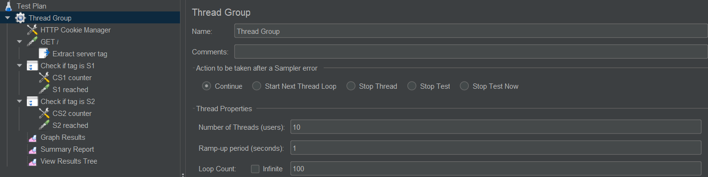
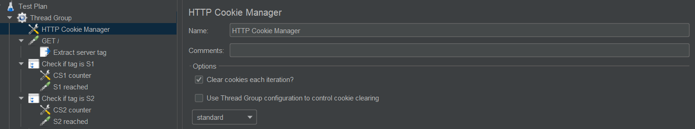
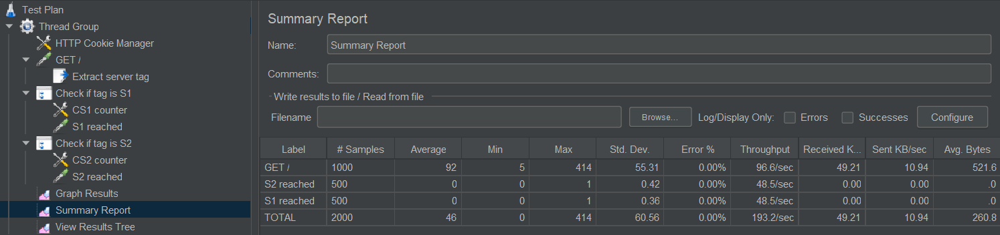
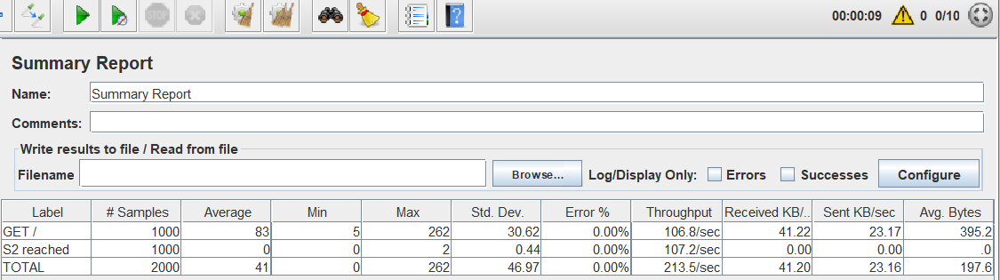
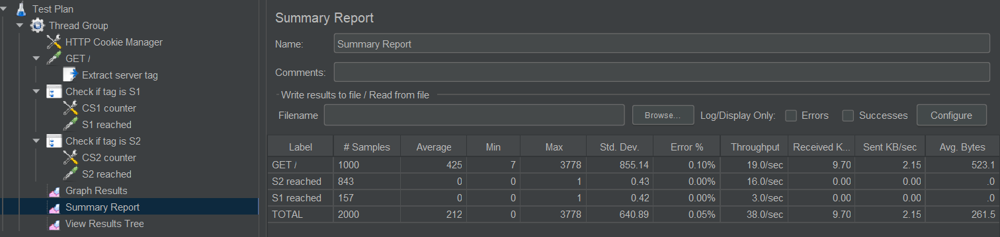

## AIT Lab 03 - Load balancing

**Author:** Müller Robin, Stéphane Teixeira Carvalho, Massaoudi Walid  
**Date:** 2020-12-02

### Introduction

### Task 1 : Install the tools
#### 1.1
When we open the browser the application create a cookie for the user with the server s1 for example.


In this screenshot we can see that the session ID NODESESSID is created when we connect to the load balancer.
This token is created by the web apps in our case the web app s1.

When we refresh the page we can see that the NODESESSID changed.


This is the case because we changed of web app server, this time it is the web app s2, and so the session created before is unknown to the current server and so a new one is created.

If we continue to refresh the page we will always change of NODESESSID because we will change of server every time and the token in NODESESSID will not be generated by the server contacted

#### 1.2
It should keep the same session id even if the user refresh the page. And for that we should not speak with a different server but with the same that created the session. Because the server that generated the session can validate the token given and so the right session.

#### 1.3


#### 1.4


From the JMeter report we can clearly see that the server is changed on every new request so that means that a round robin is surely implemented.
We can verify that by going to the config files of the load balancer. We can see that the following balancing policy is set : `balance roundrobin`. So it confirms that a round robin is used.
#### 1.5
First here is the result from the JMeter.


If we take a look at the sequence diagram this time we have the following requests :


In this case all the requests were sent to the s2 server.
We can also see a different comportement from the session handling :


This time because we comunicate with the same server we did not change of session id and the sessionView variable incremented as expected.

### Task 2
#### 2.1
The difference between the two ways of implementing the sticky session is mainly the creator of the paramaters. In the first case with the SERVERID the HAProxy will handle it so the id of the server will be added to the response of the server by the proxy to have cover of the track from which server responded.

In the second case with the NODESESSID the HAproxy will use the existing cookie to know to which server send the request. The HAproxy will then have a stick-table per backend node. The advantage of using this approach is that, if we have an application that contains static content that don't need authentification any server will be used to respond to the request.

#### 2.2
We decided to use the NODESESSID already implemented. Here is the configuration :

```bash
cookie NODESESSID prefix nocache
# Define the list of nodes to be in the balancing mechanism
# http://cbonte.github.io/haproxy-dconv/2.2/configuration.html#4-server
server s1 ${WEBAPP_1_IP}:3000 check cookie s1
server s2 ${WEBAPP_2_IP}:3000 check cookie s2
```
In the first line we say that we had a prefix to the cookie named NODESESSID we had the name of the server. So in our case we will see teh prefix s1 or s2.
Then we tell that if we receive a cookie with the prefix s1 we send to the s1 server and if we receive s2 we send to s2.

#### 2.3
As expected the session is now handled correctly we communicate with the server that initiate the connection. If we look at the cookie we can see that the HAProxy added the prefix of the name of the webapp as expected.


#### 2.4
TODO : Graphe

#### 2.5
Yes in this case the same server is reached every time so the 1000 requests were sent to the same server in our case the server s2 :


We can confirm that also be watching the content of the response of the last get that we sent :


We can see that the sessionViews has incremented to 1000.

#### 2.6
In this case we obtain the following result :


In this case we have 2000 requests GET because we set that the thread group will have 2 thread. The load balancer will then tell one user to talk to the web app and to the second user to talk to the second web app s2. This is the result of the round robin.

Then as defined in the test the thread(user) will send 1000 GET request. The first user will send 1000 requests to the server s1 and then the seond user 1000 requests to the server s2.

We can confirm the result also be watching the content of the last response of each server :


### Task 3
#### 3.1
We get the following page when we access the HAProxy statistics page:


As we can see in the nodes menu, under "Session rate", we are connected to the node s1.

#### 3.2
We started by setting the s1 node into drain with the following command:  
`> set server nodes/s1 state drain`

In the HAProxy page, we see that the node has been indeed put into drain mode:


#### 3.3
After refreshing the page, we get the following result:   
`{"hello":"world!","ip":"192.168.42.11","host":"39b872b37ed6","tag":"s1","sessionViews":34,"id":"u5uOH_iXc8vAZp3yu71dcOMIkfJUrRQk"}`

We are still on the same node, and the session views are still being incremented. While in drain mode, only the new traffic is redirected to a new node. The active sessions continue to communicate with the same node.

#### 3.4
As expected, when opening a new browser, the connection is redirected to the node s2. We get the following result:  
`{"hello":"world!","ip":"192.168.42.22","host":"cf4f8b90df17","tag":"s2","sessionViews":1,"id":"78oYzA7zknFo_9N0HwQn9gqE117u7ELA"}`

#### 3.5
However many times we clear the cookies, we are only reaching the s2 node. A new session id is generated on every connection and `sessionViews` is equals to one.  
This is the expected outcome as the proxy has no way to recognize the client without the cookies, and the node in DRAIN mode does not accept new connections.

#### 3.6
We set the s1 node into ready mode with the following command:  
`> set server nodes/s1 state ready`
1. After refreshing the page, we stay on the same node, due to sticky sessions, and `sessionViews` is still being incremented.
2. After opening a new browser, we were connected to the s2 node with `sessionViews` at 1.
3. As we clear the cookies, the sticky sessions balancing cannot not work, hence we get a new session id and `sessionViews` equals one on every refresh.

HAProxy stats page:  


#### 3.7
We set the s1 node into maint mode with the following command:  
`> set server nodes/s1 state maint`
1. After refreshing the page, we are redirected to the s2 node. This is expected as maint mode redirects all connections. We get a new session id and `sessionViews` is 1.
2. After opening a new browser, we were connected to the s2 node with `sessionViews` at 1.
3. As we clear the cookies, we get a new session id and `sessionViews` equals one on every refresh. Due to the maintenance mode, all connections go through the s2 node.

HAProxy stats page:  


### Task 4
First we gonna reset the value of the s1 delay to 0 (note that we use docker toolbox for this stage):




#### 4.1
We need to set the management policy of cookies to be deleted with every iteration .

The result as we see is a good distribution of traffic between the two servers


#### 4.2
In this step we set the delay value of s1 to 250 ms with the following command:
```bash
Walid@DESKTOP-STMV1IC MINGW64 /c/Program Files/Docker Toolbox
$ curl -H "Content-Type: application/json" -X POST -d '{"delay":250}' 192.168.99.100:4000/delay                         {"message":"New timeout of 250ms configured."}
```

As we see this value is  enough to disturb our servers ,as well the most of traffic is balanced to s2 ,however s1 still taking place in the application to respond some requests, also we have a remarkable decrease of the performance.

#### 4.3
After we increased the delay of s1 to 2500 ms we get the following results :


In this case the delay is much bigger than the previous one,so the server s1 is avoided by the most of requests .Jmeter shows that an average of 0.1% of traffic
go through s1.
#### 4.4
 There is no error in the two previous steps because  HAProxy redirects all requests from one server to another according to the round robin, however it waits for a response from the assigned server. In our case, it sends a request to S1 and while this one processes it, the S2 server will take care of all the following ones, then when S1 is available again After the long wait , it will take the next request if there is one .

#### 4.5
We need toadd the following lines to the conf file of HAProxy :
```bash
server s1 ${WEBAPP_1_IP}:3000 weight 2 check cookie s1
server s2 ${WEBAPP_2_IP}:3000 weight 1 check cookie s2
```
Then set the delay to 250 ms .

#### 4.6
 need with  cookies  picture

 without cookies:
 

The change is quite major, we can see that using cookies with a heavy weight and a slow server can drastically slow down the overall performance of our load balancer.

### Task 5
#### 5.1
We decided to implement the following strategies :
- **leastconn** : This strategy will permit to choose the server with the least connections. A round-robin is used to choose the server within groups of server with the same load. We think that this strategy is interesting because we can always choose the server with the least connections and we can avoid that a server has 1000 connections because the users do not disconnect and a server that only has 10 connections because the users quit quickly. With this strategy we can be sure that the servers will have the same amount of connection and so we can balance fairly the servers.  
Another advantage of this strategy is that it is dynamic and the the weights of the server are adjusted on the fly.
- **source** : This startegy will hash the IP adress and divid it by the total weight of the running servers to choose which server will receive the request. We decided to use this strategy because with this we can be sure that the same client IP will reach the same server as long as it is not down. So, in this case session stickness is not necessary if we wanted. The only problem if session stickness is not done is that if a server goes down the client will contact a different server so it will be better to use sticky session anyway.

#### 5.2
- **leastconn**  
In the first place, we had to configure the server to have the leastconn algorithm :


  Then we started a JMeter test with 3 users to see how the connections are handled :
  

  In the screenshot above we can see that the first server to handle the connection is s1 and so the next user will be connected to the s2 server beacause the s2 server has the least connections. Then, s1 will be called again because a roundrobin is used when servers have the same amount of connection.

  To view a difference we have started a session that will be consistent for the server s1 and then we send request to the load-balancer :
  

  In this case the server s2 that has a delay of 0 will handle all the requests beacause it will always have the least connections.

- **source**  
Like before we implemented the source algorithm in the haproxy.cfg file :
  

  For this test we removed the session stickness to show the advantage of this algorithm.
  For the JMeter test we kept 2 threads to show that if the same IP is used all the requests will go to the same server.
  Here is the result for the source algorithm with JMeter :
  
  

  As expected even if we have mutliple users connecting to the website the same server will handle all the requests from the users because they are connected with the same machine so the same IP adress.


#### 5.3
We think that for this lab the best strategy is the leastconn and we will explain why. The problem with the source algorithm is that for instance, if we have a server that will receive connections from the HEIG-VD we will have a problem beacuase all the students go on the internet with the same IP adress and so all the requests made by the students will be directed to the same server and we do not have a right balance between the servers or it could be a problem if the server cannot handle a lot of requests it cloud cause a DoS.

With the leastconn we do not have this problem because the server will have the same amount of connections. In this case if we take a look at the same example the students of the HEIG-VD will not contact the same server because when creating a connection it will not redirect to the same server if another server as least connection.

In the case of the lab, if we use the source algorithm we will only test one server because the ip adress is the local address and we will always contact or the s1 server or the s2 server. And so, we think that because of that the leastconn is more interesting because we will contact the two servers equally and we can test the 2 servers and not only one.


### Conclusion
