## AIT Lab 03 - Load balancing

**Author:** Müller Robin, Stéphane Teixeira Carvalho, Massaoudi Walid  
**Date:** 2020-10-07

### Introduction

### Task 1
#### 1.1
When we open the browser the application create a cookie for the user with the server s1 for example.

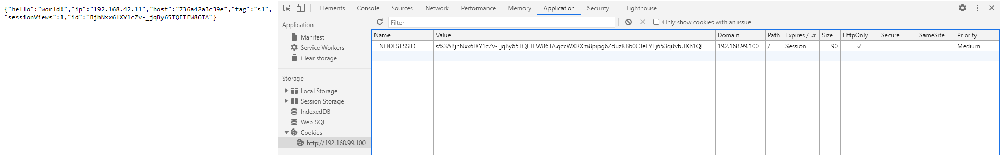

In this screenshot we can see that the session ID NODESESSID is created when we connect to the load balancer.
This token is created by the web apps in our case the web app s1.

When we refresh the page we can see that the NODESESSID changed.


This is the case because we changed of web app server, this time it is the web app s2, and so the session created before is unknown to the current server and so a new one is created.

If we continue to refresh the page we will always change of NODESESSID because we will change of server every time and the token in NODESESSID will not be generated by the server contacted

#### 1.2
It should keep the same session id even if the user refresh the page. And for that we should not speak with a different server but with the same that created the session. Because the server that generated the session can validate the token given and so the right session.

#### 1.3
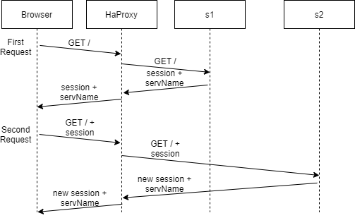

#### 1.4
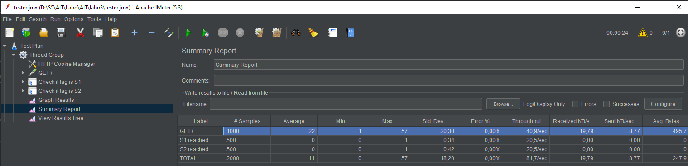

From the JMeter report we can clearly see that the server is changed on every new request so that means that a round robin is surely implemented.
We can verify that by going to the config files of the load balancer. We can see that the following balancing policy is set : `balance roundrobin`. So it confirms that a round robin is used.
#### 1.5
First here is the result from the JMeter.
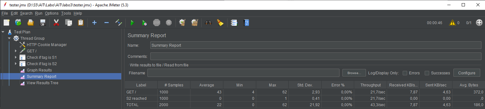

If we take a look at the sequence diagram this time we have the following requests :


In this case all the requests were sent to the s2 server.
We can also see a different comportement from the session handling :
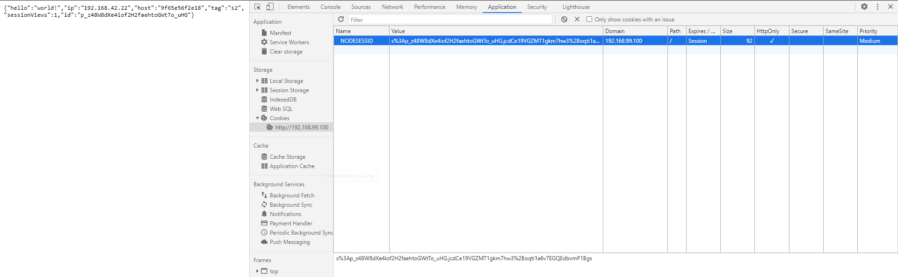
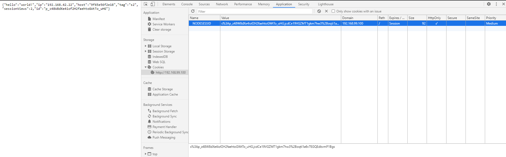

This time because we comunicate with the same server we did not change of session id and the sessionView variable incremented as expected.

### Task 2
#### 2.1
The difference between the two ways of implementing the sticky session is mainly the creator of the paramaters. In the first case with the SERVERID the HAProxy will handle it so the id of the server will be added to the response of the server by the proxy to have cover of the track from which server responded.

In the second case with the NODESESSID the HAproxy will use the existing cookie to know to which server send the request. The HAproxy will then have a stick-table per backend node. The advantage of using this approach is that, if we have an application that contains static content that don't need authentification any server will be used to respond to the request.

#### 2.2
We decided to use the NODESESSID already implemented. Here is the configuration :

```bash
cookie NODESESSID prefix nocache
# Define the list of nodes to be in the balancing mechanism
# http://cbonte.github.io/haproxy-dconv/2.2/configuration.html#4-server
server s1 ${WEBAPP_1_IP}:3000 check cookie s1
server s2 ${WEBAPP_2_IP}:3000 check cookie s2
```
In the first line we say that we had a prefix to the cookie named NODESESSID we had the name of the server. So in our case we will see teh prefix s1 or s2.
Then we tell that if we receive a cookie with the prefix s1 we send to the s1 server and if we receive s2 we send to s2.

#### 2.3
As expected the session is now handled correctly we communicate with the server that initiate the connection. If we look at the cookie we can see that the HAProxy added the prefix of the name of the webapp as expected.

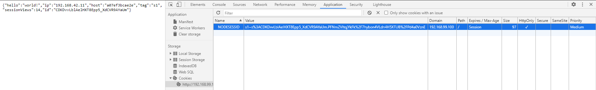

#### 2.4
TODO : Graphe

#### 2.5
Yes in this case the same server is reached every time so the 1000 requests were sent to the same server in our case the server s2 :
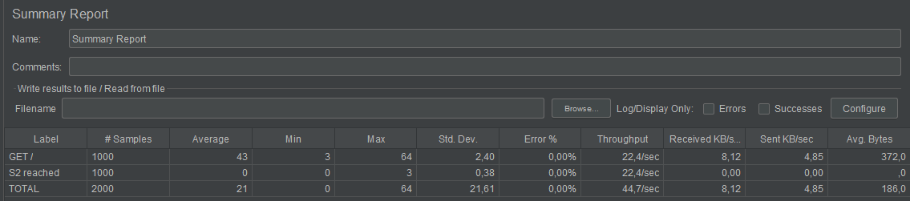

We can confirm that also be watching the content of the response of the last get that we sent :


We can see that the sessionViews has incremented to 1000.

#### 2.6
In this case we obtain the following result :


In this case we have 2000 requests GET because we set that the thread group will have 2 thread. The load balancer will then tell one user to talk to the web app and to the second user to talk to the second web app s2. This is the result of the round robin.

Then as defined in the test the thread(user) will send 1000 GET request. The first user will send 1000 requests to the server s1 and then the seond user 1000 requests to the server s2.

We can confirm the result also be watching the content of the last response of each server :
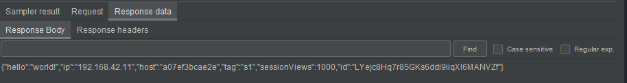
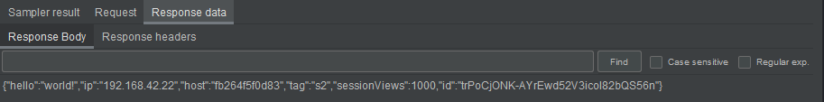


### Task 3
#### 3.1
We get the following page when we access the HAProxy statistics page:
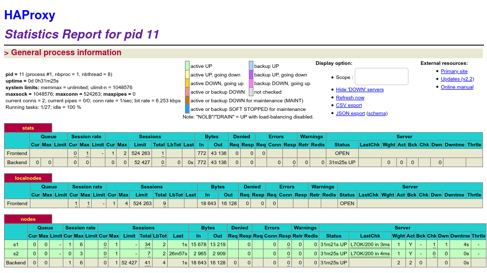

As we can see in the nodes menu, under "Session rate", we are connected to the node s1.

#### 3.2
We started by setting the s1 node into drain with the following command:  
`> set server nodes/s1 state drain`

In the HAProxy page, we see that the node has been indeed put into drain mode:
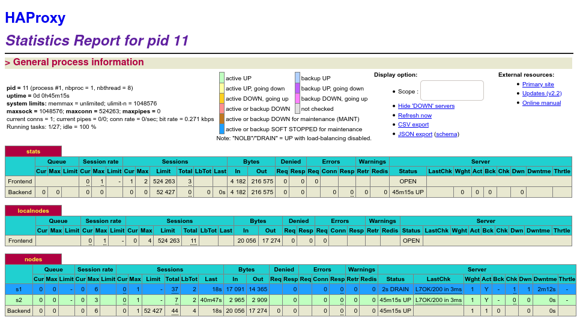


#### 3.3
After refreshing the page, we get the following result:   
`{"hello":"world!","ip":"192.168.42.11","host":"39b872b37ed6","tag":"s1","sessionViews":34,"id":"u5uOH_iXc8vAZp3yu71dcOMIkfJUrRQk"}`

We are still on the same node, and the session views are still being incremented. While in drain mode, only the new traffic is redirected to a new node. The active sessions continue to communicate with the same node.

#### 3.4
As expected, when opening a new browser, the connection is redirected to the node s2. We get the following result:  
`{"hello":"world!","ip":"192.168.42.22","host":"cf4f8b90df17","tag":"s2","sessionViews":1,"id":"78oYzA7zknFo_9N0HwQn9gqE117u7ELA"}`


### Task 4

### Task 5

### Conclusion
