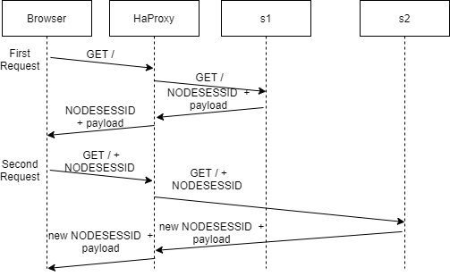

## AIT Lab 03 - Load balancing

**Author:** Müller Robin, Stéphane Teixeira Carvalho, Massaoudi Walid  
**Date:** 2020-12-02

### Introduction

In this laboratory, we will configure a load-balancer with different configuration like sticky sessions or drain mode. We will also look at the results with the different modifications. We will also look at what happens when a server is lower than another. At the end, we will look at two new algorithms to choose a node and compare them by showing results and choose the most suitable for the laboratory.


### Task 1 : Install the tools
#### 1.1
After starting the different containers using docker compose, when we open the browser we can see the following result :


A JSON payload is shown containing the name of the server that responded and the session id and more.

If we look at the application tab in the development tools we can see that a cookie is created for the user with the server s1.
Here is an example of it.


In this screenshot we can see that the session id NODESESSID is created when we connect to the load balancer.
This token is created by the web apps in our case the web app s1. And so the session is created with the server s1.

When we refresh the page we can see that the NODESESSID changed and the name of the server too.


This is the case because the load balancer redirected us to a different server. This time it is the web app s2, hence the session created before is unknown to the current server and so a new one is created and the value of the cookie is changed.

If we continue to refresh the page we will always get a different NODESESSID as we will change the server ip every time, and the token in NODESESSID will not have been generated by the server contacted so the value will be updated. The sessionViews variable will not be incremented and stay at the value 1.

#### 1.2
It should keep the same session id even if the user refresh the page. For that, we should not speak with a different server, but with the same that created the session. We would like that because, the server that generated the session can validate the token given and so keep the right session. We should add Session Stickiness or use a different algorithm than roundrobin to have this behavior.

#### 1.3


The first request will go to the server s1. The server will then respond with a cookie related to the session created and the payload to show.
The client will then store the cookie and in the next request send it with it. This time because we use the roundrobin we will send the request to the second server s2. The server will then see the request but the session passed is not known to him and so, in the response a new cookie will be sent with a new session for the server s2. The client will then store this new value and send it in the next request.

The next request will be redirected to the server s1 and he will react the same way as the server s2 in the last request.

#### 1.4


From the JMeter report we can clearly see that the server is changed on every new request so that means that a round robin is surely implemented.
We can verify that by checking the config files of the load balancer. We can see that the following balancing policy is set : `balance roundrobin`. So it confirms that a round robin is used.
#### 1.5
First here is the result from JMeter.


If we take a look at the sequence diagram this time we have the following requests :


In this case all the requests were sent to the s2 server because the load balancer will only see one server available and all the requests will be sent to it. The roundrobin as no effect here.
We can also see a different behavior from the session handling :


This time because we communicate with the same server we did not change our session id and the sessionView variable incremented as expected and the same session is being used every time.

### Task 2 : Sticky sessions
#### 2.1
The difference between the two ways of implementing sticky sessions is mainly the creator of the parameters. In the first case with the SERVERID the HAProxy will handle it so the id of the server will be added to the response of the server by the proxy to track which server responded. The SERVERID will only be seen by the HAProxy, the servers will not see it has it will be a parameter in the http header in the cookie section.
Here is a diagram of the situation :


In the second case, with the NODESESSID, the HAproxy will use the existing cookie to determine where to send the request. The HAproxy will receive the response with a cookie and add a prefix that is the name of the server that responded. Then, when the load-balancer will receive a request it will look at the prefix and redirect the request to the right server. The advantage of using this approach is that, if we have an application that contains static content that doesn't require authentication, any server will be used to respond to the request. With the SERVERID once a connection is started, every subsequent request will be sent to the same server every time.
Here is a diagram of the situation :


#### 2.2
We decided to use the NODESESSID cookie that is already implemented. Here is the configuration :

```bash
cookie NODESESSID prefix nocache
# Define the list of nodes to be in the balancing mechanism
# http://cbonte.github.io/haproxy-dconv/2.2/configuration.html#4-server
server s1 ${WEBAPP_1_IP}:3000 check cookie s1
server s2 ${WEBAPP_2_IP}:3000 check cookie s2
```
In the first line we say that we add a prefix to the cookie named NODESESSID, the prefix being the name of the server. So in our case we will see the prefix s1 or s2.  
Then we tell that if we receive a cookie with the prefix s1 we use the s1 server and if we receive s2 we use s2.

#### 2.3
As expected the session is now handled correctly we communicate with the server that initiate the connection. If we look at the cookie we can see that the HAProxy added the prefix of the name of the webapp as expected. If we refresh the page we keep the connection with the same server and the sessionsViews is incremented.


#### 2.4


In this case, in the response of the request, the cookie will have a prefix that indicates the server to contact for the load balancer it will be added as a prefix and the token generated by the app will start after the ~. So, if we refresh the page the cookie will be kept and the request sent to the load-balancer that will then redirect it to the right server, in this diagram the server s2.

When a new browser is used because of the round robin the server s1 will be contacted. The HAProxy(load-balancer in the graph) will send the request to the server and then in the response it will add, as for the server s2, the prefix of the name of the server in our case s1. If the page is refreshed the load-balancer will act the same way as the first browser.

#### 2.5
Yes in this case the same server is reached every time so the 1000 requests were sent to the same server in our case the server s2 :


We can confirm that also by watching the content of the response of the last GET that we sent :


We can see that the sessionViews has incremented to 1000 so the same session has been used for the 1000 requests.

#### 2.6
In this case we obtain the following result :


We have 2000 GET requests because we set that the thread group will have 2 thread so 2 users. The load balancer will then tell one user to talk to the web app and the second user to talk to the second web app s2. This is a result of the round robin.

Then as defined in the test the thread(user) will send 1000 GET requests. The first user will send 1000 requests to the server s1 and then the second user 1000 requests to the server s2.

We can confirm the result also by watching the content of the last response of each server :


### Task 3 : Drain mode
#### 3.1
We get the following page when we access the HAProxy statistics page:


As we can see in the nodes menu, under "Session rate", we are connected to the node s1.

#### 3.2
We started by setting the s1 node into drain mode with the following command:  
`> set server nodes/s1 state drain`

In the HAProxy page, we see that the node has been indeed put into drain mode (nodes menu, under "Status"):


#### 3.3
After refreshing the page, we get the following result:   
`{"hello":"world!","ip":"192.168.42.11","host":"39b872b37ed6","tag":"s1","sessionViews":34,"id":"u5uOH_iXc8vAZp3yu71dcOMIkfJUrRQk"}`

We are still on the same node, and the session views are still being incremented. While in drain mode, only the new traffic is redirected to a new node. The active sessions continue to communicate with the same node.

#### 3.4
As expected, when opening a new browser, the connection is redirected to the node s2. We get the following result:  
`{"hello":"world!","ip":"192.168.42.22","host":"cf4f8b90df17","tag":"s2","sessionViews":1,"id":"78oYzA7zknFo_9N0HwQn9gqE117u7ELA"}`

#### 3.5
However many times we clear the cookies, we are only reaching the s2 node. A new session id is generated on every connection and `sessionViews` is equals to one.  
This is the expected outcome as the proxy has no way to recognize the client without the cookies, and the node in DRAIN mode does not accept new connections.

#### 3.6
We set the s1 node into ready mode with the following command:  
`> set server nodes/s1 state ready`
1. After refreshing the page, we stay on the same node, due to sticky sessions, and `sessionViews` is still being incremented.
2. After opening a new browser, we were connected to the s2 node with `sessionViews` at 1.
3. As we clear the cookies, the sticky sessions balancing cannot not work, hence we get connected to a different server every time, meaning a new session id and `sessionViews` equals one.

HAProxy stats page:  


#### 3.7
We set the s1 node into maint mode with the following command:  
`> set server nodes/s1 state maint`
1. After refreshing the page, we are redirected to the s2 node. This is expected as a server in maint mode refuses all connections (existing and new). We get a new session id and `sessionViews` is 1.
2. After opening a new browser, we were connected to the s2 node with `sessionViews` at 1. This is the effect of the roundrobin algorithm.
3. As we clear the cookies, we get a new session id and `sessionViews` equals one on every refresh. Due to the maintenance mode, all connections go through the s2 node.

HAProxy stats page:  


### Task 4 : Round robin in degraded mode

#### 4.1
First we are going to reset the value of the s1 delay to 0ms. We will take a measurement with Jmeter at this stage as a reference.
The management policy of cookies to be conserved with every iteration .

The result as we see is a good distribution of traffic between the two servers

#### 4.2
In this step we set the delay value of s1 to 250 ms.

As we see this value is enough to disturb our servers. We have a remarkable decrease of the performance, the throughput is decreased in s1 due the time taken by each request, mostly caused by the delay.

#### 4.3
After we increased the delay of s1 to 2500 ms we get the following results :


In this case the delay is much bigger than the previous one, so the server s1 is avoided by the most of the requests. Jmeter shows that, in fact, s1 is not even reachable and all the traffic is redirected to s2.

#### 4.4
 There is no error in the two previous steps, because  HAProxy redirects all requests from one server to another according to the round robin, however it waits for a response from the assigned server. In our case, it sends a request to S1 and while this one processes it, the S2 server will take care of all the following ones, then when S1 is available again after the long wait, it will take the next request if there is one.

#### 4.5
We need to add the following lines to the conf file of HAProxy :
```bash
server s1 ${WEBAPP_1_IP}:3000 weight 2 check cookie s1
server s2 ${WEBAPP_2_IP}:3000 weight 1 check cookie s2
```
Then set the delay to 250 ms. We can the see the following results


With the previous configuration, S1 has a higher weight, so it handles a greater workload. The time of execution is therefore even longer. An ideal solution would be to redirect less traffic to servers that are slower.

#### 4.6
 The following picture shows the results of Jmeter after clearing the cookies with every iteration.  
 

The change is quite major. We see that more load is processed by the faster node or we can say the available one. This is due to the concurrent session limit on each node.The node cannot process more than a limited  simultaneous sessions and in our case it takes 250 ms before responding. The Proxy server HAProxy will therefore send the incoming requests to a node which is available in this case the S2 node.


### Task 5 :  Balancing strategies
#### 5.1
We decided to implement the following strategies :
- **leastconn** : This strategy will permit to choose the server with the least connections. A round-robin is used to choose the server within groups of server with the same load. We think that this strategy is interesting because we can always choose the server with the least connections and we can avoid that a server has 1000 connections because the users do not disconnect and a server that only has 10 connections because the users quit quickly. With this strategy we can be sure that the servers will have the same amount of connections and so we can balance fairly the servers.  
Another advantage of this strategy is that it is dynamic and the weights of the server are adjusted on the fly.
- **source** : This strategy will hash the IP address and divide it by the total weight of the running servers to choose which server will receive the request. We decided to use this strategy because with this we can be sure that the same client IP will reach the same server as long as it is not down. So, in this case session stickiness is not strictly necessary, however if a server goes down the client will contact a different server so it would be better to use sticky session anyway. Another problem that can appear is when a new server is up. In this case, due to the hash function a new server can be contacted if no session stickiness is enabled.

#### 5.2
- **leastconn**  
In the first place, we had to configure the server to have the leastconn algorithm :


  Then we started a JMeter test with 3 users to see how the connections are handled :
  

  In the screenshot above we can see that the first server to handle the connection is s1 and so the next user will be connected to the s2 server because the s2 server has the least connections. Then, s1 will be called again because a roundrobin is used when servers have the same amount of connection.

  To view a difference we have started a session that will be consistent for the server s1 and then we send request to the load-balancer :
  

  In this case the server s2 that has a delay of 0 will handle all the requests because it will always have the least connections.

- **source**  
Like before we implemented the source algorithm in the haproxy.cfg file :
  

  For this test we removed the session stickness to show the advantage of this algorithm.
  For the JMeter test we kept 2 threads to show that if the same IP is used all the requests will go to the same server.
  Here is the result for the source algorithm with JMeter :
  
  

  As expected even if we have multiple users connecting to the website the same server will handle all the requests from the users because they are connected with the same machine so the same IP address.


#### 5.3
We think that for this lab the best strategy is the leastconn and we will explain why. The problem with the source algorithm is that for instance, if we have a server that will receive connections from the HEIG-VD we will have a problem because all the students go on the internet with the same IP address and so all the requests made by the students will be directed to the same server and we do not have a right balance between the servers. This could lead to a problem if the server cannot handle a lot of requests it could cause a DoS for instance.

With the leastconn we do not have this problem because the server will have the same amount of connections. In this case, if we take a look at the same example, the students of the HEIG-VD will not contact the same server because when creating a connection it will not redirect to the same server if another server has a least amount connection.

In the case of the lab, if we use the source algorithm, we will only test one server because the ip address is the local address and we will always contact either the s1 server or the s2 server. And so, we think that because of that the leastconn is more interesting because we will contact the two servers equally and we can test the 2 servers and not only one.

### Conclusion
To conclude, we found this laboratory interesting because we could practice the theory seen in the course. It was also interesting to see what can happen if a load-balancer has a slower server or if the session stickness is not enabled. Seeing multiple balancing strategies and to choose between them is also an interesting point in the laboratory.

Finally, we are happy with the result that we have and we think that we completed the laboratory successfully.
